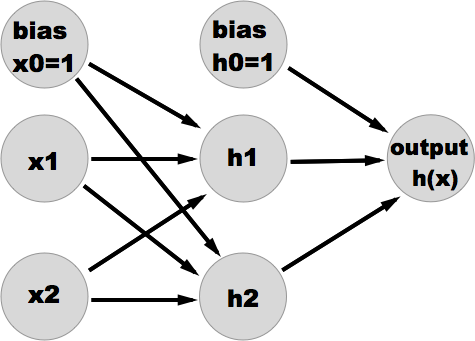
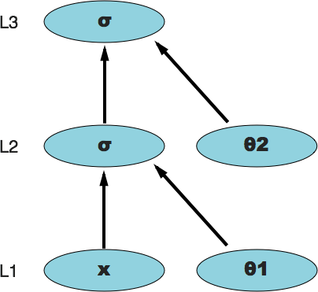
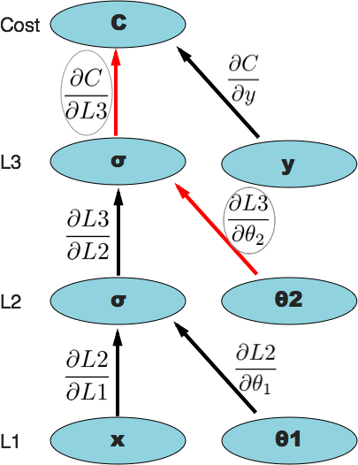
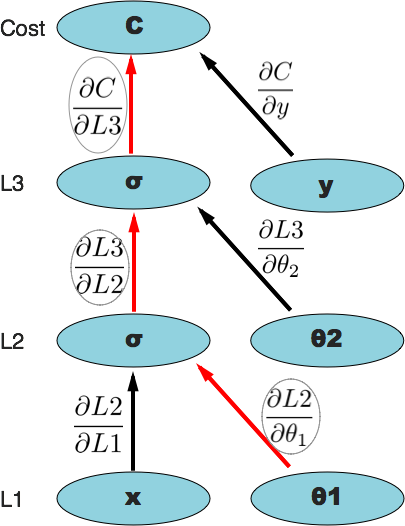

On chain rule, computational graphs, and backpropagation
---------------------

##### ...Another post on backpropagation?
Sort of. I know, everyone and their brother has a post on backpropagation.
In fact, I *already* have a post on backpropagation here, so why am I writing *another*
post? Well, for one, this post isn't really about backpropagation per se, it's
about how we can think about neural networks in a completely different way than
we're used to using a computational graph representation and then use it to
derive backpropagation from a fundamental formula of calculus, chain rule.

This post is entirely inspired from colah's blog post [Calculus on Computational Graphs: Backpropagation](http://colah.github.io/posts/2015-08-Backprop/) so please
read through that first. I will reiterate a lot of what's on there but will surely
not do as good a job. My purpose here is more an extension of that post to
thinking about neural networks as computational graphs.

######Assumptions:
I assume you remember some high school calculus on taking derivatives, and I assume you already know
the basics about neural networks and have hopefully implemented one before.

##### Calculus' chain rule, a refresher

Before I begin, I just want to refresh you on how chain rule works. Of course you can skip
this section if you know chain rule as well as you know your own mother.

[Chain rule](https://en.wikipedia.org/wiki/Chain_rule#Composites_of_more_than_two_functions) is the process
we can use to analytically compute derivatives of *composite functions*. A composite function is a function
of other function(s). That is, we might have one function $f$ that is composed of multiple inner or nested functions.

For example,
$$f(g(h(x)))$$ is a composite function. We have an outer function $f$, an inner function $g$, and the final inner function $h(x)$

Let's say $f(x) = e^{sin(x^2)}$, we can decompose this function into 3 separate functions:

$f(x) = e^x $, $g(x) = sin(x)$, and $h(x) = x^2$, or what it looks like as a nested function:
$$f(g(h(x))) = e^{g(h(x))}$$

And to get the derivative of this function with respect to x, $\frac{d{f}}{d{x}}$, we use the chain rule:

$$\frac{d{f}}{d{x}} = \frac{df}{dg} * \frac{dg}{dh} * \frac{dh}{dx}$$, such that,
$$\frac{df}{dg} = e^{g(h(x))} $$ (because the derivative of $e^x$ is just $e^x$),
$$\frac{dg}{dh} = cos(h(x))$$ (because the derivative of $sin$ is $cos$),
$$\frac{dh}{dx} = 2x$$
therefore...
$$\frac{d{f}}{d{x}} = e^{\sin x^2} * \cos x^2 * 2x$$
So in each of these cases, I just pretend that the inner function is a single variable and derive it as such.
The other way to view it,

$$f(x) = e^{sin(x^2)}$$, then create some temporary, substitution variables
$u = sin(v)$, and $v = x^2$, now $f(u) = e^u$, and you can use chain rule as above.

##### Computational graphs
A computational graph is a representation of a composite function as a network of connected nodes, where each node is an operation/function.
It is similar in appearance to a feedforward neural network (but don't get them confused). When we visualize these graphs, we can easily see all the nested relationships and follow some basic rules to come up with derivatives of any node we want.

Let's visualize the above simple composite function as a computational graph.

As you can see, the graph shows what inputs get sent to each function. Every connection is an input, and every node is a function or operation
(used here interchangeably).

What's neat about these graphs is that we can *visualize* chain rule. All we need to do is get the derivative of each node with respect
to each of its inputs.

Now you can follow along the graph and do some dimensional analysis to compute whichever derivatives you want by multiplying
the 'connection' derivatives (derivatives between a pair of connected nodes) along a path. For example, if we want to get $df/dx$, we simply multiply the connection derivatives starting from $f$ all the way to $x$, which gives us the same equation as the chain rule formula above:
$$\frac{df}{dx} = \frac{df}{\cancel{dg}} * \frac{\cancel{dg}}{\cancel{dh}} * \frac{\cancel{dh}}{dx} $$

Now all of that was probably painfully obvious to a lot of you, but I just want to make this as accessible as possible.

#####Re-imagining neural networks as computational graphs

A neural network, if you haven't noticed, is essentially a massive nested composite function. Each layer of a feedforward
neural network can be represented as a single function whose inputs are a weight vector and the outputs of the previous layer. This means we can build a nice computational graph out of it and use it to derive the backpropagation algorithm.

Here's a 3 layer neural network (1 input layer, 1 hidden layer, 1 output layer), which could be used to solve something like the good ol' XOR problem.

So that is just a typical feedforward neural network visualization. Nothing new here, should be very familiar. Of course there are weight vectors hanging around in between the layers. It's a very intuitive and convenient representation of a neural network in terms of the information flow through the network. However, I don't think it's the best way to think about it or visualize it in terms of a computational implementation. We're going to try re-visualizing this as a computational graph, such that each node is no longer an abstract "neuron" with weights modulating the connection to other neurons, but instead where each node is a single computation or operation and the arrows are no longer weighted connections but merely indications of where inputs are being 'sent'. I'm going to switch these graphs to a vertical orientation just for better presentation, and the notation will be different.

Here L3 denotes the output layer, L2 the hidden layer, and L1 the input layer. Similarly, $\theta\_2$ denotes the weight vector 'between' layer 2 and layer 3; $\theta\_1$ denotes the weight vector 'between' layer 1 and layer 2. The $\sigma$ notation just refers to the sigmoid operation that takes place within those particular nodes (however, the *outputs* of those nodes will be referred to using the L notation, i.e. L1, L2, and L3).

As you can see, it's a fairly different way of looking at the neural network. This is a functional representation. It shows the step by step functions that occur and the inputs those functions operate on. For example, the L2 layer function operates on two inputs: the L1 layer outputs (a vector) and the weight vector $\theta\_1$. Likewise, the L3 function operates on L2 and $\theta\_2$, and is our final output. If you're wondering where the bias nodes went, they're implicitly included in each L layer's output (i.e. the scalar 1 is added to each L vector). Each weight vector still contains a weight for the bias.

Let's list out the computational steps to compute the neural network output, L3.

$$ \begin{align}
&\sigma(x) = \frac{1}{1+e^{-x}} \text{, define the sigmoid/logistic function} \\\\
&X = [x\_1, x\_2]       \text{, the vector containing our two input values} \\\\
&L1 = [X, 1]            \text{, add a bias value of 1}\\\\
&L2 = [\sigma(L1 * \theta\_1), 1] \text{, add bias and compute L2}\\\\
&L3 = \sigma(L2 * \theta\_2) \text{, compute L3}\\\\
\end{align}
$$

Now let's compute the 'connection' derivatives. This is just simple calculus on individual functions. Remember that $\sigma'=\sigma(1-\sigma)$

$$
L3 = \frac{1}{1+e^{-\theta\_2 L2}} \\\\
u = \theta\_2 L2 \\\\
L3 = \frac{1}{1+e^{-u}} \\\\
\frac{\partial{L3}}{\partial{L2}} = \frac{\partial L3}{\partial u} * \frac{\partial u}{\partial L2} \\\\
\frac{\partial{L3}}{\partial{L2}} = \theta\_2 * L3(1-L3) \\\\
\frac{\partial{L3}}{\partial{\theta\_2}} = L2 * L3(1-L3) \\\\
\frac{\partial{L2}}{\partial{L1}} = \theta\_1 * L2(1-L2) \\\\
\frac{\partial{L2}}{\partial{\theta\_1}} = L1 * L2(1-L2) \\\\
$$

Here's our computational graph again with our derivatives added.

#####Backpropagation

Remember that the purpose of backpropagation is to figure out the partial derivatives of our cost function (whichever cost function we choose to define), with respect to each individual weight in the network: $\frac{\partial{C}}{\partial\theta\_j}$, so we can use those in gradient descent. We've already seen how we can create a computational graph out of our neural network where the output layer is a composite function of the previous layers and the weight vectors. In order to figure our $\frac{\partial{C}}{\partial\theta\_j}$, we can extend our computational graph so that the 'outer' function is our cost function, which of course has to be a function of the neural network output.

Everything is the same as the computational graph of just our neural network, except now we're taking the output of the neural network and feeding it into the cost function, which also requires the parameter $y$ (the expected value given the input(s) $x$).

The most common cost function used for a network like this would be the __cross-entropy cost function__, with the generic form being:
$$C(\theta) = \frac 1m * \sum\_1^m [-y * log((h\_{\theta}(x))) - (1 - y)(log(1 - (h\_{\theta}(x)))]$$
where $h\_{\theta}(x)$ is the output (could be a scalar or vector depending on the number of output nodes) of the network, $y$ is the expected value given input(s) $x$, and $m$ is the number of training examples.

We can get the derivative of this cost function with respect to the output layer function L3 (aka $h\_{\theta}(x)$) to add to our computational graph. It's not worth going through the steps to derive it here, but if you ask [WolframAlpha](http://www.wolframalpha.com/input/?i=%E2%88%92y%E2%88%97log%28x%29%E2%88%92%281%E2%88%92y%29%28log%281%E2%88%92x%29%29%2C+d%2Fdx) to do it, it will give you this:
$${L3}' = \frac{L3 - y}{L3(1-L3)}$$
So now we have everything we need to compute $\frac{\partial{C}}{\partial\theta\_j}$. Let's compute $\frac{\partial{C}}{\partial\theta\_2}$ and see if it compares to the textbook backpropagation algorithm.

We're just following the path from the top (the cost function) down to the node we're interested in, in this case, $\theta\_2$. We multiply the partial derivatives along that path to get $\frac{\partial{C}}{\partial\theta\_2}$. As you'll notice, it's obvious from a dimensional analysis perspective that doing this multiplication gets us what we want. We already calculated what the 'connection' derivatives were above, so we'll just substitute them back in and do the math to get what we want.

$$
\frac{\partial{C}}{\partial{L3}} = \frac{L3 - y}{L3(1-L3)} \\\\
\frac{\partial{L3}}{\partial{\theta\_2}} = L2 * L3(1-L3) \\\\
\frac{\partial{C}}{\partial\theta\_2} = \frac{\partial{C}}{\partial{L3}} * \frac{\partial{L3}}{\partial{\theta\_2}} \text { this is what we want} \\\\
\frac{\partial{C}}{\partial\theta\_2} = \frac{L3 - y}{\cancel{L3(1-L3)}} * L2 * \cancel{L3(1-L3)} \\\\
\frac{\partial{C}}{\partial\theta\_2} = (L3 - y) * L2\\\\
$$

It should be clear that this is in fact the same result we'd get from backpropagation by calculating the node deltas and all of that. We just derived a more general form of backpropagation by using a computational graph.

But you might still be skeptical, let's calculate $\frac{\partial{C}}{\partial\theta\_1}$, one more layer deep, just to prove this is a robust method. Same process as above. Again, here's a visualization of the path we follow along the computational graph to where we want. You can also just think of it as dimensional analysis.

$$
\frac{\partial{C}}{\partial{L3}} = \frac{L3 - y}{L3(1-L3)} \\\\
\frac{\partial{L3}}{\partial{L2}} = \theta\_2 * L3(1-L3) \\\\
\frac{\partial{L2}}{\partial{\theta\_1}} = L1 * L2(1-L2) \\\\
\frac{\partial{C}}{\partial{\theta\_1}} = \frac{\partial{C}}{\partial{L3}} * \frac{\partial{L3}}{\partial{L2}} * \frac{\partial{L2}}{\partial{\theta\_1}} \text{this is what we want} \\\\
\frac{\partial{C}}{\partial{\theta\_1}} = \frac{L3 - y}{\cancel{L3(1-L3)}} * \theta\_2 * \cancel{L3(1-L3)} * L1 * L2(1-L2) \\\\
\frac{\partial{C}}{\partial{\theta\_1}} = (L3 - y) * \theta\_2 *  L1 * L2(1-L2) \\\\
$$

And there you have it. Just to check against the usual backpropagation method:
######Comparing against ordinary backpropagation
We would start by calculating the output node delta: $\delta^3 = (L3 - y)$
Then we would calculate the hidden layer delta:
$$
\delta^2 = (\theta\_2 * \delta^3) \odot (L2(1 - L2))
$$
Now that we have all the layer deltas (we don't calculate deltas for input layer), we use this formula to get $\frac{\partial{C}}{\partial{\theta\_j^l}}$:

$$ \frac{\partial{C}}{\partial{\theta\_j^l}} = \delta^{l+1} * L\_l$$
where $l$ is the layer number, thus L2 is the hidden layer output.
In our case, we'll find $\frac{\partial{C}}{\partial{\theta\_1}}$
$$ \frac{\partial{C}}{\partial{\theta\_1}} = \delta^{2} * L1$$ then we'll substitute in $\delta^2$ from our calculation above
$$ \frac{\partial{C}}{\partial{\theta\_1}} = (\theta\_2 * \delta^3) \odot (L2(1 - L2)) * L1$$
and we'll substitute in $\delta^3$
$$ \frac{\partial{C}}{\partial{\theta\_1}} = (\theta\_2 * (L3 - y)) \odot (L2(1 - L2)) * L1$$

Important to note that with the derivation using the computational graph, we have to be careful about dimensional analysis and when to use which multiplication operator (dot product or element-wise), whereas with textbook backpropagation, those things are made more explicit. The computational graph method above makes it seem like we only use dot products when that might be computationally impossible. Thus, the computational graph method requires a bit more thought.

#####Conclusion

I think representing neural networks (and probably all types of algorithms based on composite functions) as computational graphs is a fantastic way of understanding how to implement one in code in a functional way and allows you to have all sorts of differential fun with ease. They give us the tools to derive backpropagation from an arbitrary neural network architecture. For example, by unfolding a recurrent neural network, we could generate a computational graph and apply the same principles to derive backpropagation through time.

######References

1. http://colah.github.io/posts/2015-08-Backprop/
2. https://en.wikipedia.org/wiki/Chain_rule
3. https://en.wikipedia.org/wiki/Automatic_differentiation
4. http://www.wolframalpha.com
